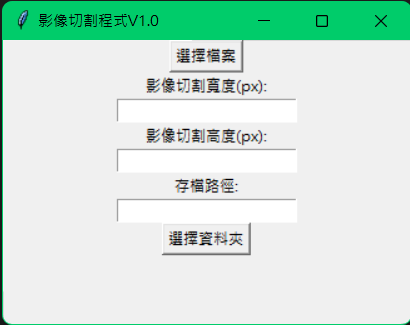

# 影像切割程式V1.0
 ```mermaid
graph LR;
開啟程式-->選擇影像
選擇影像-->調整切割大小
調整切割大小-->選擇存檔位置
選擇存檔位置-->程式自動切割並保存
```
## 介紹  
影像切割程式v1.0可協助進行影像分割，目前支援 `tiff`, `jpg`, `jpeg` 及 `png` 檔案，  
並將所選影像切割保存為 `jpg`  

開啟介面：  
  
+ 選擇檔案：可開啟一個至多個影像檔案(支援 `tiff`, `jpg`, `jpeg` 及 `png` 檔案)  
+ 影像切割高度、寬度：切分後單張相片大小，單位為pixel  
+ 存檔：點選`選擇資料夾`選擇存檔路徑，切分後的程式碼將會在您所選資料夾內建立新資料夾，  
新資料夾名稱為`[當天日期][影像檔案名稱]`  
切割後影像名稱為`[影像檔案名稱]_[x]_[y].jpg`  
+ 顯示「影像切割完成」畫面即完成  
 
